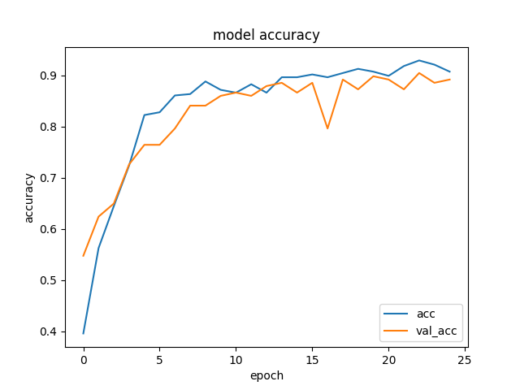
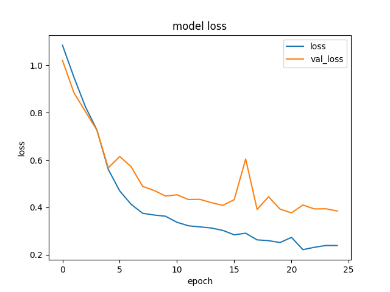

# Kerasでオリジナル画像を学習／予測、分類

## 環境

- Python 3.6.1


## インストール

```
$ git clone https://github.com/yoshiweb/keras-image-classify.git
$ cd keras-image-classify
$ pip install -r requirements.txt
```


## 事前準備

- 学習用の素材を準備（imgディレクトリに学習させたい画像をフォルダごとに格納）


### 例：りんご、バナナ、みかんを画像判別させるものを作りたい場合

> `img/apple/フォルダ`に「りんご」の画像をたくさんいれる  
> `img/banana/フォルダ`に「バナナ」の画像をたくさんいれる  
> `img/orange/フォルダ`に「みかん」の画像をたくさんいれる  


## 学習

```
$ python keras_cnn_train.py
```

以下の2ファイルが生成されます

- `keras_cnn_model.h5` 学習済みモデルデータ
- `label.txt` 判別するラベル名が順番に記載されてる


### 精度（正解率）

- acc（青い線）：学習データでの検証結果
- val_acc（オレンジ）：学習に使用してない画像での検証結果

  


### 損失（どれくらい間違ってるか）

1=全然違う、0=あってる（ロジスティック関数）


- loss（青い線）：学習データでの検証結果
- val_loss（オレンジ）：学習に使用してない画像での検証結果

  


## 予測・分類

判別したい画像を引数に渡して実行

```
$ python keras_cnn_predict.py img/orange/image_01.jpg
Using TensorFlow backend.
2019-01-10 11:45:37.519288: I tensorflow/core/platform/cpu_feature_guard.cc:141] Your CPU supports instructions that this TensorFlow binary was not compiled to use: AVX2 FMA
{"result": [{"apple": "0.0080241589", "banana": "0.0055331937", "orange": "0.9864426851"}]}
```

この場合「みかん」の可能性が一番高いと判断した。
